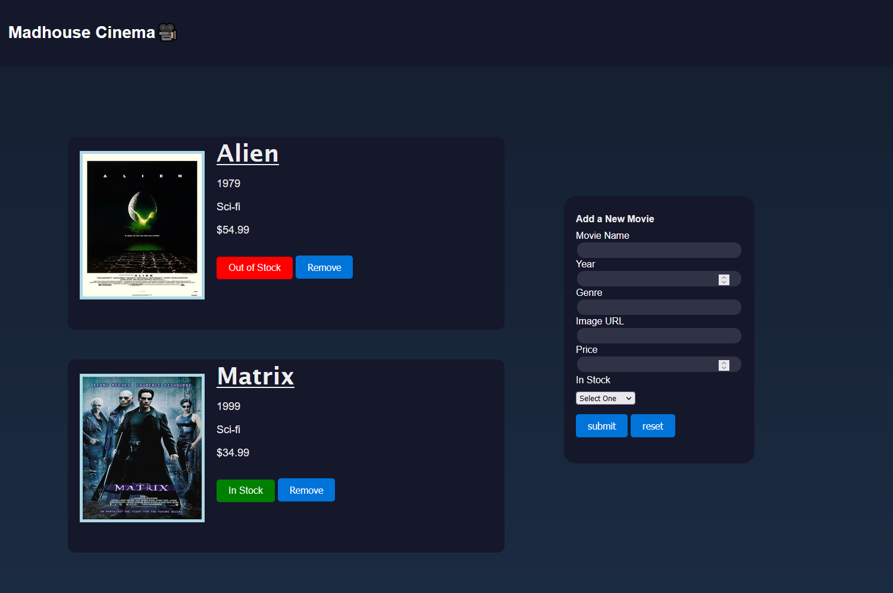
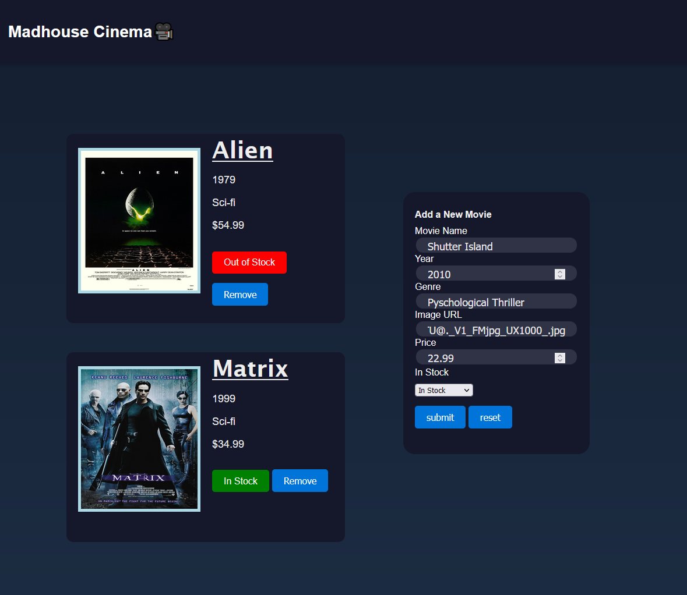
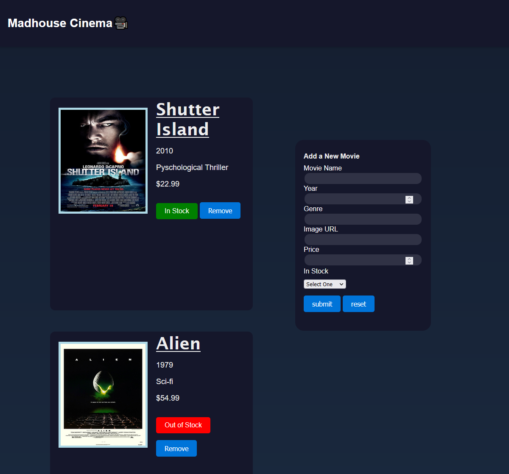

# Inventory-Web-Application-Project

## Movie Store Inventory

This is a movie inventory management system implemented in HTML and JavaScript. The application allows users to add new movies to the inventory, display existing movies, and toggle the in stock/out of stock status.

Getting Started

1. Clone the repository.
2. Open the index.html file in your preferred web browser.
3. Use the form to add new movies and interact with the existing inventory.

Input the relevant information in to the form as shown:

* Movie Name
* Year
* Genre
* Image URL
* Price
* In Stock

And when you hit submit it will update the existing inventory:

